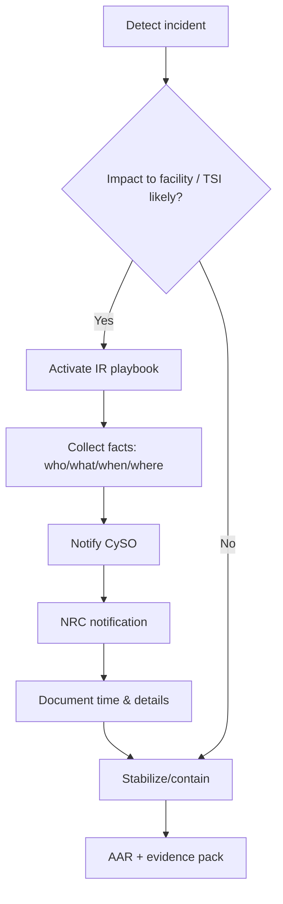
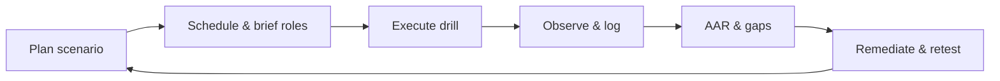
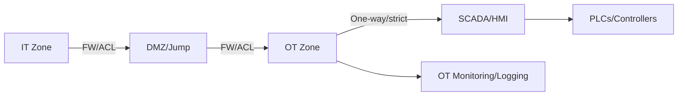

# MTSA Examples and Diagrams

## Purpose

Provide concrete scenarios and simple visuals to help teams apply MTSA requirements with minimal ambiguity.

---

## Scenario Playbooks (quick examples)

### 1) OT Ransomware Attempt
- **Context**: Malware detected on an engineering workstation connected to OT.
- **Actions**: Isolate affected segment (RA/segmentation), disable compromised accounts (PR.AC / IAC), activate incident playbook, notify CySO, prepare NRC notification if impact to operations is likely.
- **Evidence**: Network isolation logs, account disablement, IR timeline, NRC notification (if sent), AAR.

### 2) Vendor Remote Access Misuse
- **Context**: Vendor VPN account used off-hours to access PLC network.
- **Actions**: Suspend vendor credentials (PR.AC/UC), review logs, verify change approvals, notify facility security if physical access is suspected, determine NRC criteria.
- **Evidence**: Access review, VPN logs, change tickets, AAR with remediation (stricter just-in-time access).

### 3) OT Patch Deferral with Compensating Controls
- **Context**: Critical patch cannot be applied within maintenance window.
- **Actions**: Risk accept with compensating controls (deny-list routes, increased monitoring, allowlisting), schedule patch window, document SL-T impact (if using 62443).
- **Evidence**: Risk acceptance, compensating controls in place, monitoring alerts baseline, scheduled patch date.

### 4) NRC-Reportable Cyber Incident
- **Context**: Cyber event disrupts cargo operations; potential TSI impact.
- **Actions**: Execute NRC notification playbook, capture time of discovery and report, maintain comms log, stabilize operations per Cyber Plan.
- **Evidence**: NRC call log/ticket, IR timeline, system recovery steps, AAR.

---

## Diagrams (Mermaid)

### NRC Incident Reporting Swimlane

### Drill and Exercise Flow

### OT/IT Segmentation Overview

---

## How to Reuse

- Attach scenarios and diagrams as appendices in the Cybersecurity Plan or drills documentation.
- Keep evidence references (logs, AARs, call records) aligned with the Cross-Framework Evidence Matrix.
- Refresh scenarios annually or after major environment changes.
