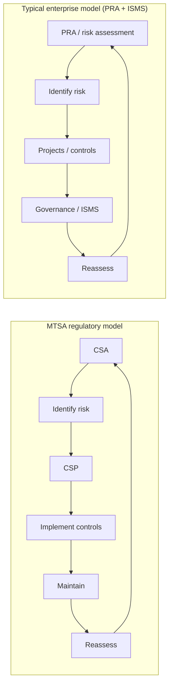
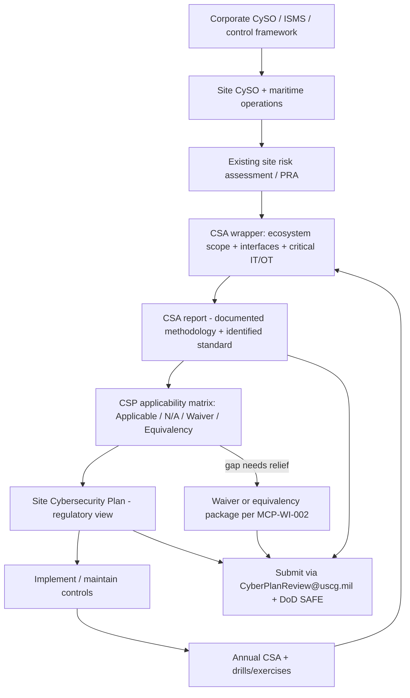
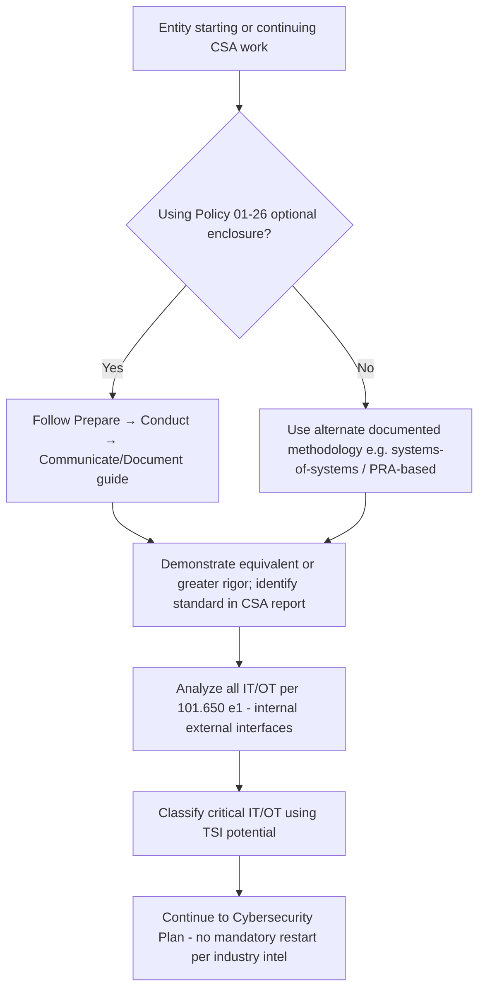

# Email Exchange: MTSA Cybersecurity Policy Letters (June 2026)

**Captured**: 2026-06-08  
**Source**: Chemical-sector email thread (June 2026) — industry practitioner intelligence  
**Status**: Industry intelligence + AI-assisted gap analysis — **not** a verified regulatory source  
**Related**: `research/regulatory-change/Public_Source_Refresh_and_Project_Delta_2026-06-08.md` §4–5; `research/coast-guard-engagement/Coast_Guard_Engagement_and_Inspection_Readiness.md` §11

---

## 1. Thread summary

| Layer | From | Date | Audience | Purpose |
|-------|------|------|----------|---------|
| **Original** | Steve Roberts, Chemical Security Group / Roberts Law Group | Sun **June 7, 2026** | Chemical-sector MTSA stakeholders | Summarize CG-MCP meeting at USCG HQ after Friday publication of Policy 01-26 and MCP-WI-002/003 |
| **Practitioner analysis** | Large-chemical enterprise OT security lead | Mon **June 8, 2026** | Enterprise compliance team | Summarize Roberts’ note; **AI-assisted** mapping of existing site/corporate programs to CSA/CSP requirements |

**Attachments (4 USCG PDFs)** — identical set to `documentation/reference-downloads/uscg-cyber-2026/`:

- CG-5PC Policy Letter 01-26 (CSA scoping and process; signed June 2, 2026)
- MCP-WI-002 + enclosures (waiver/equivalency; signed June 4, 2026)
- MCP-WI-003 (DoD SAFE submission; signed June 4, 2026)

**Embedded images**: Two PNGs extracted to `documentation/reference-downloads/email-2026-06-08/` — signature/branding only; **no compliance flow diagram** in binary form. Process flows in the thread are **text arrows** (reproduced as mermaid below).

---

## 2. Steve Roberts — key points (industry intelligence)

Roberts met **CG-MCP at USCG headquarters** on the same day the June 2026 policy package published. His bullets (paraphrased for reuse; see §8 for quotes):

1. **Subpart F remains mandatory** — entities must comply with **33 CFR Part 101, Subpart F**.
2. **Policy Letter CSA scoping methodology is not mandatory** — the enclosure is an optional guide.
3. **Alternate approaches permitted** — e.g., “systems of systems” to identify in-scope IT/OT, with methodology documented in the CSA.
4. **No restart for early adopters** — entities that began scoping under a **different documented methodology** need not start over; continue toward Cybersecurity Plan development.
5. **Maritime Commons post expected** — CG-MCP planned a blog for broader stakeholder communication.

### Accuracy vs verified USCG sources

| Roberts claim | Verification |
|---------------|--------------|
| Policy Letter scoping guide **not mandatory** | ✅ **Confirmed** — Policy 01-26 §5.c: enclosure is an “optional guide” |
| Alternate frameworks with **equivalent or greater rigor** | ✅ **Confirmed** — Policy 01-26 enclosure ¶4 |
| **CSA obligation unchanged** | ✅ **Confirmed** — **33 CFR 101.650(e)(1)** |
| “Systems of systems” as named approach | ⚠️ **Paraphrase** of CG-MCP discussion — reasonable but not literal Policy Letter language |
| **Need not start over** if prior methodology documented | ⚠️ **Consistent with Policy text**; Roberts adds oral CG-MCP reassurance — **await Maritime Commons** for citable official narrative |
| Maritime Commons blog forthcoming | ⚠️ **Unverified** as of capture date — monitor and mirror when live |

---

## 3. Copilot analysis — key points

Copilot mapped an **enterprise chemical-sector pattern** (site PRA + corporate ISMS/controls) to MTSA CSA/CSP. Distilled claims:

### 3.1 CSA ↔ existing assessment program

- CSA ≈ site **PRA** with **expanded scope**: internal systems, external dependencies, interfaces.
- Outputs: risks, **critical IT/OT** classification, basis for CSP.
- Alignment on threat/vulnerability analysis, segmentation, and risk scoring — with gaps on **ecosystem documentation** (corporate IT, historians, MES, cloud, AD, vendor OEM links).

### 3.2 CSP ↔ existing governance

- CSP = execution plan from CSA: controls, waiver/equivalency justifications, lifecycle.
- Maps to site architecture + **corporate control baseline** (IEC/NIST-aligned standards).
- Gap remediation via existing project/remediation backlog; continuous improvement via **ISMS** cycles.

### 3.3 Documentation gaps (Copilot emphasis)

| Gap theme | MTSA expectation | Typical enterprise gap |
|-----------|------------------|-------------------------|
| **Traceability** | Requirement → system → risk → control → decision | Risk → controls mapping often implicit |
| **Full ecosystem scope** | External dependencies in CSA | Corporate services not always in site PRA scope |
| **N/A vs waiver** | N/A when system absent; waiver/equivalency when present but non-compliant | Not systematically classified per requirement |
| **Waiver/equivalency** | Formal packages per **MCP-WI-002** | Informal risk acceptance / engineering judgment |
| **SSI / submission** | CSA/CSP as SSI; **DoD SAFE** via **CyberPlanReview@uscg.mil** | External regulatory submission workflow |

### 3.4 Recommended operating model (Copilot)

1. **CSA wrapper** around existing PRA — add explicit asset inventory (incl. dependencies), interface mapping, critical IT/OT designation.
2. **CSP as regulatory view** — applicability matrix: Applicable / N/A / Waiver / Equivalency.
3. **Requirement-level traceability table** — clause | system | applies? | control | gap | action | justification.
4. **Waiver/equivalency playbook** — criteria, templates, approval workflow tied to assessment evidence.
5. **Position corporate framework as equivalency candidate** — only where clause-level crosswalk supports **101.665** requests.

### 3.5 Copilot accuracy assessment

**Well-reasoned / aligned with repo and PDFs:**

- CSA risk-filtering across **all** networks; internal / external / interface categories (Policy 01-26).
- Baseline Subpart F measures beyond critical IT/OT only.
- CSA informs CSP; initial CSP need not close every finding.
- Completed **CSA prerequisite** for waiver/equivalency (**MCP-WI-002** Enclosure 1).
- **N/A ≠ waiver** (e.g., remote OT access absent → N/A with explanation, not waiver).
- SSI handling and DoD SAFE submission path (**MCP-WI-003**).

**Oversimplified / do not adopt as compliance position:**

| Issue | Risk |
|-------|------|
| **“80–90% aligned” / “already compliant”** | Unverifiable; compliance is demonstrated in **CSA/CSP artifacts**, not inferred from program maturity |
| **“Fully defensible equivalency model”** | Overstates — **WI-002 Q17** requires clause-level crosswalk, certification evidence, **Coast Guard approval**; no blanket credit for “similar regulations” |
| **TSL → critical IT/OT** | Useful analogy; critical IT/OT must follow **TSI criteria (33 CFR 101.105)**, not only safety/production impact |
| **Compensating controls** | Copilot underplays **WI-002 Q16** limits on compensating controls without equivalency |
| **Waiver discipline** | Missing warnings: no “just in case” waivers (Q7), not for cost/convenience alone (Q12), not preemptive (Q10) |
| **Submission mechanics** | Mentions DoD SAFE but not **14-day** code, password-in-separate-email, or routing (waiver → CG-5P; OCS waiver → District) |
| **Roberts headline** | Copilot does not stress **continuity for early adopters** — the most actionable thread intel for enterprises already doing PRA-like work |

---

## 4. Diagrams

### 4.1 Regulatory lifecycle (text from email — mermaid)

Copilot contrasted MTSA’s regulatory model with a typical enterprise assessment lifecycle:

**Interpretation**: Structurally equivalent intent; MTSA adds **explicit traceability**, **applicability classification**, and **regulator-facing packaging**.

### 4.2 Enterprise chemical-sector operating model (synthesized)

Combines Copilot’s “wrapper + regulatory view” pattern with the project’s **corporate framework strategy** — generic pattern for multi-site chemical manufacturers with mature OT/IT programs:

### 4.3 Roberts — optional guide vs mandatory CSA (decision framing)

### 4.4 Embedded PNG assets

| File | Content |
|------|---------|
| `email-copilot-diagram-1-9d6837e3.png` | 20×20 inline icon |
| `email-copilot-diagram-2-998f9147.png` | Email signature banner (company + technical expertise branding) |

No process flow was attached as an image; flows above are reproduced from email text and project synthesis.

---

## 5. Comparison to project positions

| Topic | Project position (June 2026 refresh) | Email thread alignment |
|-------|--------------------------------------|------------------------|
| CSA scoping (Policy 01-26) | All-network analysis; critical IT/OT filter; optional guide | ✅ Copilot and Roberts align; Roberts adds continuity reassurance |
| Corporate framework leverage | Document once, reference in site plans; ISO 27001 alignment | ✅ Copilot “wrapper + regulatory view” matches `MTSA_Corporate_Framework_Strategy.md` |
| Waivers / equivalencies | CSA first; no blanket similar-regulation credit; routing per WI-002 | ✅ Copilot mostly right; equivalency auto-recognition **overstated** |
| DoD SAFE submission | CyberPlanReview@uscg.mil; 14-day window; SSI | ⚠️ Copilot mentions SSI/SAFE but omits operational detail — see `research/plan-submission/Cybersecurity_Plan_Submission_Process.md` |
| TSI / trade–commerce | Criticality based on trade/commerce impact, not company profitability | ⚠️ Copilot uses TSL/business framing — project TSI research still applies |
| Training | Jan 2026 deadline passed; annual + triggers | Not discussed in thread; repo updated separately |

---

## 6. Actionable takeaways for the MTSA compliance project

1. **Treat Roberts as strategic headline, Copilot as gap checklist** — prioritize “don’t restart if methodology is documented” while building audit-ready CSA/CSP artifacts.
2. **Implement the mapping layer** — requirement traceability table and applicability matrix are the highest-value deliverables for mature enterprises.
3. **Separate three concepts** — (a) using PRA as **CSA methodology**, (b) **N/A** documentation, (c) **101.665 equivalency** requests; do not collapse into one “we’re already compliant” narrative.
4. **Expand scope documentation** — corporate dependencies, cloud, vendor OEM, and **interface-level** risk paths per Policy 01-26.
5. **Formalize waiver/equivalency** — templates and approval workflow before July 2027 plan submission; respect WI-002 guardrails.
6. **Prepare SSI-safe submission** — integrate DoD SAFE workflow into plan development, not as an afterthought.
7. **Monitor Maritime Commons** — when CG-MCP blog publishes, update `VERIFIED_REFERENCES.md` and downgrade “secondary source” flags in §2.
8. **Do not import Copilot percentages** into governed implementation docs.

---

## 7. Gap priority matrix (from Copilot — validated framing)

| Priority | Gap | Project action |
|----------|-----|----------------|
| 🔴 High | Traceability (requirement → system → risk → control → decision) | Build CSP mapping tables; extend implementation guide templates |
| 🔴 High | Single cohesive CSA artifact | CSA wrapper document consolidating PRA outputs + ecosystem scope |
| 🔴 High | Applicability classification (Applicable / N/A / Waiver / Equivalency) | Standardize per-control columns in site CSP |
| 🔴 High | Formal waiver/equivalency governance | Playbook aligned to MCP-WI-002 enclosures |
| 🟡 Medium | External dependency integration in CSA | Corporate–site interface inventory |
| 🟡 Medium | Interface-focused risk modeling | Emphasize connections, not only assets |
| 🟡 Medium | Regulator-readable CSP format | Site plan template structured for USCG review |
| 🟢 Low | Risk-based methodology, NIST/IEC controls, ISMS lifecycle | Leverage existing corporate framework references |

---

## 8. Quotes worth retaining

**Steve Roberts (June 7, 2026):**

> Companies must comply with the regulatory provisions noted in 33 CFR Part 101 – Subpart F. The CSA process / scoping methodology in the Policy Letter **is not mandatory**…

> Companies are free to utilize alternate approaches (e.g., “systems of systems” approach) to identify IT/OT “in scope”…

> Companies that have identified IT/OT “in scope” using a methodology or process that is different from Policy Letter **do not need to start over or change their process** and should continue ahead toward Cybersecurity Plan development.

> CG-MCP will be posting a blog on the USCG’s **Maritime Commons** website…

**AI-assisted gap analysis (June 8, 2026):**

> The gap is **not security—it is structure + defensibility**

> **CSA ≈ PRA (with expanded scope expectations)**

> If system doesn’t exist → Not Applicable; If exists but not compliant → waiver/equivalency

**Policy 01-26 (verified PDF in repo):**

> Enclosure (1) contains an **optional guide** to conducting a CSA.

> entities are free to utilize other industry standards or assessment frameworks/models to conduct a CSA with **equivalent or greater rigor**, and entities should **identify the standard(s) used** in the CSA report.

**MCP-WI-002 Enclosure 1, Q8 (verified):**

> If a vessel's architecture does not include remote OT access, the MFA requirement is not waived; it is correctly designated as **“Not Applicable” (N/A)** with written explanation in the CSP.

---

## 9. Provenance and reuse notes

- **Generic reuse**: Patterns apply to **chemical and similar process industries** with corporate ISMS + site OT risk programs; remove site-specific examples (unit names, product systems) when sharing externally.
- **Not for VERIFIED_REFERENCES**: Roberts email and Copilot output remain **secondary** until Maritime Commons or formal USCG guidance cites the same continuity position.
- **PDF attachments**: Use canonical copies under `documentation/reference-downloads/uscg-cyber-2026/`.

---

*Part of the MTSA Cybersecurity Compliance Research Repository.*
